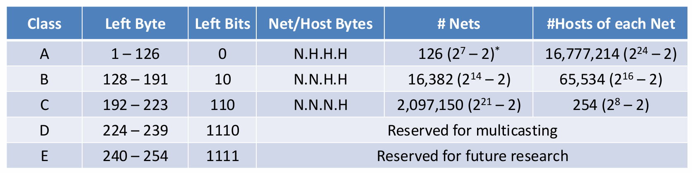

@import "./markdown.less"


# Number Systems

## 任意数转十进制


## 十进制转任意数


## 转换成二进制补码


## 浮点表示

Mantissa：


# Fundamentals of C Language

## 数据类型


## 按位运算


# Arrays. Strings Structures

1. `const char* greet = "Hello"`: 以这种方式定义的字符串存在于只读存储区，不能修改其内容

2. `char greet[] = "Hello"`: 以这种方式定义的字符串存在于栈区，但等效于`char* const greet`，不可以修改指针指向

3. 字符串函数

    

4. `struct`, `typedef`
    ```c
    struct Point {
      int x;
      int y;
    }  // define
    struct Point p1;  // declare
    p1 = {1, 2};  // initialize
    
    typedef struct Point {
      int x;
      int y;
    } Point;  // define and typedef

    typedef struct {
      int x;
      int y;
    } Point;  // define and typedef

    Point p1 = {1, 2};  // declare and initialize

    typedef struct node {
      int value;
      struct node* next;
    } Node, *NodePtr;
    ```

# Dynamic Memory Allocation. Linked Lists

## 链表操作

```c
#include <stdio.h>
#include <stdlib.h>

struct node {
    int number;
    struct node *next;
};

void insert_node(struct node **head, struct node **tail, int value) {
    struct node *new_node = (struct node *)malloc(sizeof(struct node));
    if (new_node == NULL) {
        fprintf(stderr, "Memory allocation failed\n");
        exit(EXIT_FAILURE);
    }
    new_node->number = value;
    new_node->next = NULL;

    if (*tail == NULL) {
        *head = *tail = new_node;
    } else {
        (*tail)->next = new_node;
        *tail = new_node;
    }
}

void print_list(struct node *head) {
    int count = 0;
    struct node *current = head;
    while (current != NULL) {
        count++;
        printf("%d -> ", current->number);
        current = current->next;
    }
    printf("NULL\n");
    printf("List size: %d\n", count);
    printf("List capacity: %lu\n", count * sizeof(struct node));
}

void free_list(struct node *head) {
    struct node *current = head;
    struct node *next;
    while (current != NULL) {
        next = current->next;
        free(current);
        current = next;
    }
}

struct node *last_occur(struct node *h, int x) {
    struct node *last = NULL;
    struct node *current = h;

    while (current != NULL) {
        if (current->number == x) {
            last = current;
        }
        current = current->next;
    }

    return last;
}

void delete_node(struct node **ph, int x) {
    struct node *current = *ph;
    struct node *previous = NULL;

    if (current != NULL && current->number == x) {
        *ph = current->next;
        free(current);
        return;
    }

    while (current != NULL && current->number != x) {
        previous = current;
        current = current->next;
    }

    if (current == NULL) return;

    previous->next = current->next;
    free(current);
}
```

# Files. Input and Output

1. `FILE * fopen( const char *filename, const char *mode );`

    

2. `int fclose(FILE *stream);` 成功返回0，失败返回EOF。

3. `int getchar(void)`：从标准输入读取一个字符，返回该字符的ASCII码，如果到达文件末尾或发生错误，返回EOF（-1）。

4. `int putchar(int c)`：将字符c输出到标准输出，返回c，如果发生错误，返回EOF。

5. `int fgetc(FILE *stream)`：从文件流中读取一个字符，返回该字符的ASCII码，如果到达文件末尾或发生错误，返回EOF（-1）。

6. `int fputc(int c, FILE *stream)`：将字符c输出到文件流，返回c，如果发生错误，返回EOF。

7. `int fscanf(FILE *stream, const char *format, ...)`：从文件流中读取数据，按照format格式解析，返回成功读取的参数个数，如果到达文件末尾或发生错误，返回EOF。

8. `int fprintf(FILE *stream, const char *format, ...)`：将数据按照format格式写入文件流，返回成功写入的参数个数，如果发生错误，返回EOF。

9. `int ferror(FILE *stream)`：检查文件流是否有错误，如果有错误返回非零值，否则返回0。

10. `int feof(FILE *stream)`：检查文件流是否到达文件末尾，如果到达文件末尾返回非零值，否则返回0。

11. `int fflush(FILE *stream)`：刷新文件流，将缓冲区中的数据写入文件，如果成功返回0，否则返回EOF。

    

# More about Strings and Pointer Arithmetic

1. `char *gets(char *str)`：从标准输入读取一行字符串，直到遇到**换行符或文件结束符**，**将换行符替换为空字符**，并返回指向str的指针。如果发生错误，返回NULL。

2. `int puts(const char *str)`：将字符串str输出到标准输出，**并在末尾添加换行符**。返回非负值。

3. `char *fgets(char *str, int n, FILE *stream)`：从文件流中读取一行字符串，直到遇到**换行符或文件结束符**，**保留换行符**，并返回指向str的指针。如果发生错误，返回NULL。

4. `int fputs(const char *str, FILE *stream)`：将字符串str输出到文件流，**不添加换行符**。返回非负值。

5. `char *strncpy(char *dest, const char *src, size_t n)`：将src的前n个字符复制到dest，如果src的长度小于n，则用空字符填充dest。返回dest。

6. `char *strchr(const char *str, int c)`：在字符串str中查找字符c，**返回指向该字符的指针**，如果未找到，返回NULL。

7. `char *strstr(const char *haystack, const char *needle)`：在字符串haystack中查找字符串needle，**返回指向该字符串的指针**，如果未找到，返回NULL。

8. `int sprintf(char *str, const char *format, ...)`：将数据按照format格式写入字符串str，返回成功写入的字符个数，如果发生错误，返回EOF。

# More Memory Management


1. `void * memmove(void *dst, const void *src, size_t len);`: 将src指向的内存块中的len个**字节**复制到dst指向的内存块中，如果dst和src重叠，则保证复制正确。返回dst。具体地，如果 源地址 < 目标地址，而且 区域有重叠，memmove 会从后往前拷贝，避免数据被覆盖。如果 源地址 > 目标地址 或者 没有重叠，它就可以从前往后正常拷贝。

2. `void* calloc(size_t num, size_t size);`: 分配num个大小为size的内存块，并将所有字节初始化为0。返回指向分配的内存块的指针，如果分配失败，返回NULL。

3. `void* realloc(void *ptr, size_t size);`: 重新分配ptr指向的内存块的大小为size，如果ptr为NULL，则相当于malloc(size)。如果ptr不为NULL，则原来的内存块会被释放，并返回指向新分配的内存块的指针。如果size为0，则原来的内存块会被释放，并返回NULL。

# Bit Fields. Bitwise Operators


1. Bit Field Size 通常应该是`unsigned`类型的，而且遵循结构体对齐规则：

    - 一旦一个`unsigned int`字段无法完全容纳在当前 4 字节中，编译器会自动换到新的单元。
    - 实际结构体大小由编译器决定，会受 对齐和打包策略 影响。

2. 不能对 Bit Field 取地址。

3. 按位运算：

    - 将最高位（第 8 位）的位设为 0 ：`x &= 0x7F;`
    - 将最高位（第 8 位）的位设为 1 ：`x |= 0x80;`
    - 找出两个二进制数中不同的位：`x ^ y;`（结果中`1`表示不同的位）
    - 反转二进制数中的所有位：`~x;`
    - 把前 4 位设为`1101`，后四位不变：`x = (x & 0x0F) | 0xD0;`
    - 反转第2、5、8位，其它位不变：`x ^= 0x92`。（与`1`做异或操作等同于反转）

4. 对于右移操作（`>>`）：
    - 通常相当于除以 2 的幂。例如，`x >> 1` 相当于 `x / 2^1`。
    - 如果被移位的值的符号位是 0（即该值是非负数），那么右移后空出来的高位用 0 填充。
    - 如果符号位是 1（即该值是负数），那么右移后空出来的高位用什么填充是与实现相关的。在大多数情况下，空位会用 1 填充。

5. 对于左移操作（`<<`）：

    - 通常相当于乘以 2 的幂。例如，`x << 1` 相当于 `x * 2^1`。
    - 但可能会导致高位溢出。

# The C Preprocessor

1. 带参数的`#define`宏：

    ```c
    #define SQR(x) ((x) * (x))
    #define MIN(a,b) a < b ? a : b
    ```
    确保宏参数被括号包围，以保证正确的运算顺序。
2. `#define`中的`#`

    ```c
    #define PRINT(x) printf(#x "\n")

    PRINT(Hello); // #x is “Hello”
    ```

3. `#define`中的`##`

    ```c
    #define CONCAT(a, b) a ## b

    int main(void) {
        int xy = 10;
        printf("%d", CONCAT(x, y)); // 10
        return 0;
    }
    ```
4. 其他宏

    ```c
    #if DEBUG == 1
    printf("Token = %s\n", tok);
    #elif DEBUG == 2 
    printf("No. of words = \n", nw);
    #else
    printf("No debug info\n");
    #endif
    ```

    ```c
    #define DEBUG 1
    #undef DEBUG  // 取消 DEBUG 的定义
    #ifdef DEBUG
    printf("No. of words = \n", nw); 
    #endif
    ```

    ```c
    #ifndef STRUCT_H  // 确保头文件只被引入一次
    #define STRUCT_H
    #include "struct_def.h"
    #endif
    ```

    ```c
    #ifndef INTEL
    #error Wrong architecture  // 在预处理阶段报错
    #endif
    ```

5. `#pragma`指令

    ```c
    #pragma soft-float
    /* 告知编译器，目标系统没有硬件浮点单元，
    应当使用软件库实现浮点运算  */
    #pragma MC68000
    /* 生成适用于Motorola 68000 CPU的机器代码. */
    #pragma pack(1)  
    /* 要求编译器在内存中紧密排列结构体成员，
    不进行任何填充。 */
    ```

6. 预定义宏

    ```c
     #include <stdio.h>
    int main() {
    printf("File :%s\n", __FILE__ ); // main.c
    printf("Date :%s\n", __DATE__ ); // Apr 14 2025
    printf("Time :%s\n", __TIME__ ); // 18:20:27
    printf("Line :%d\n", __LINE__ ); // 7
    }
    printf("ANSI :%d\n", __STDC__ ); // 1
    ```
7. 链接多个文件

    ```bash
    gcc main.c max.c avg.c
    ```

    或者：

    ```bash
    # 只编译不链接
    gcc -c main.c && gcc -c max.c && gcc -c avg.c
    # 链接
    gcc main.o max.o avg.o
    ```
8. 生成可执行文件的过程

    

9. 变量类型属性对照表

| 类型 / 关键字            | 作用域（Scope）  | 链接属性（Linkage）        | 存储持续时间（Storage Duration） | 初始值            | 可被其他 `.c` 文件访问 | 说明                  |
| ------------------- | ----------- | -------------------- | ------------------------ | -------------- | -------------- | ------------------- |
| **局部变量**（普通）        | 函数内部（块作用域）  | 无链接                  | 自动（函数调用时创建）              | **未定义（随机）**    | ❌              | 栈上分配，生命周期随函数结束      |
| **局部静态变量** `static` | 函数内部（块作用域）  | 无链接                  | **静态**（程序运行期）            | 默认 **0**       | ❌              | 函数内保留值，多次调用共享       |
| **全局变量**            | 文件范围（全文件可见） | **外部链接（external）**   | **静态**                   | 默认 **0**       | ✅              | 默认可供其他文件访问          |
| **静态全局变量** `static` | 文件范围（当前文件）  | **内部链接（internal）**   | **静态**                   | 默认 **0**       | ❌              | 用于隐藏全局变量，模块私有       |
| **外部变量声明** `extern` | 当前文件（只声明）   | 取决于定义处（通常是 external） | 由定义处决定（通常是静态）            | 无（只声明）         | ✅              | 不分配内存，仅告诉编译器变量定义在别处 |
| **函数参数**            | 函数内部        | 无链接                  | 自动                       | **未定义（调用时传入）** | ❌              | 实际是局部变量的一种          |
| **静态函数** `static`   | 当前 `.c` 文件  | **内部链接（internal）**   | 静态（整个程序运行期）              | -              | ❌              | 仅能在当前文件使用           |
| **普通函数定义**          | 全局          | **外部链接（external）**   | 静态                       | -              | ✅              | 默认全局函数可被其他文件调用      |


# Programming at the Kernel Level

1. `man`：1 - 用户命令；2 - 系统调用；3 - C 标准库函数
2. `void perror(const char *buffer)`：打印错误信息，buffer 是错误信息的前缀。


# Files in POSIX

1. 文件权限


2. 传入结构体指针的函数的要求

```c
struct stat buf;  // 在栈上分配内存 
stat(fname, &buf);
```

```c
struct stat *buf;
stat(fname, buf);  // 错误，buf 没有分配内存
buf = malloc(sizeof(struct stat));  // 分配内存后调用 stat
```

- **`int open(const char *pathname, int oflag);`**：打开或创建一个文件。`pathname` 是文件路径，`oflag` 是打开文件的方式（read only `O_RDONLY`；write only `O_WRONLY`；read/write `O_RDWR`）。返回文件描述符，若失败返回 -1。
- **`int open(const char *pathname, int oflag, mode_t mode);`**：与上一个函数类似，但当创建文件时，`mode` 参数用于指定文件的权限。返回文件描述符，若失败返回 -1。
- **`int close(int fd);`**：关闭一个已打开的文件描述符 `fd`。成功返回 0，失败返回 -1。
- **`int dup(int fd);`**：复制文件描述符 `fd`，返回一个新的文件描述符，该新描述符与原描述符共享同一个文件。
- **`ssize_t read(int fd, void *buf, size_t n);`**：从文件描述符 `fd` 指向的文件中读取最多 `n` 个字节到缓冲区 `buf`。返回实际读取的字节数，若到达文件末尾返回 0，失败返回 -1。
- **`ssize_t write(int fd, void *buf, size_t n);`**：将缓冲区 `buf` 中的 `n` 个字节写入文件描述符 `fd` 指向的文件。返回实际写入的字节数，失败返回 -1。
- **`mode_t umask(mode_t mask);`**：设置文件创建掩码。`mask` 是掩码值，函数返回之前的掩码值。掩码用于限制文件的默认权限。
- **`mode_t chmod(const char *path, mode_t mode);`**：改变文件 `path` 的权限为 `mode`。成功返回 0，失败返回 -1。
- **`int chown(const char *path, uid_t owner, gid_t group);`**：改变文件 `path` 的所有者为 `owner`，所属组为 `group`。成功返回 0，失败返回 -1。
- **`off_t lseek(int fd, off_t offset, int flag);`**：移动文件描述符 `fd` 的读写指针。`offset` 是偏移量，`flag` 指定偏移的基准（如从文件开头、当前位置等）。返回新的偏移量，失败返回 -1。
- **`int stat(const char *path, struct stat *statbuf);`**：获取文件 `path` 的状态信息，存入 `statbuf` 指向的结构体中。成功返回 0，失败返回 -1。
    ```c
    void stat_size() {
        char *file = "myfile.txt";
        long long size; // st_size can be a 64-bit int.
        struct stat *buf = malloc(sizeof(struct stat)); // allocates memory for stat structure.

        if (stat(file, buf) == 0) {
            size = buf->st_size;
            printf("Size of \"%s\" is %lld bytes.\n", file, size);
        } else { perror(file); }
    }
    ```
- **`int link(const char *oldPath, const char *newPath);`**：创建文件 `oldPath` 的硬链接 `newPath`。成功返回 0，失败返回 -1。
- **`int unlink(const char *pathname);`**：删除文件 `pathname` 的链接。如果文件没有其他链接，则文件被删除。成功返回 0，失败返回 -1。
- **`int symlink(const char *target, const char *linkpath);`**：创建符号链接 `linkpath`，指向目标 `target`。成功返回 0，失败返回 -1。
- **`int mkdir(const char *path, mode_t mode);`**：创建目录 `path`，权限为 `mode`。成功返回 0，失败返回 -1。
- **`int rmdir(const char *path);`**：删除空目录 `path`。成功返回 0，失败返回 -1。
- **`DIR *opendir(const char *path);`**：打开目录 `path`，返回目录流指针。失败返回 `NULL`。
- **`int closedir(DIR *dir);`**：关闭目录流 `dir`。成功返回 0，失败返回 -1。
- **`struct dirent *readdir(DIR *dir);`**：从目录流 `dir` 中读取下一个目录项，返回目录项指针。若无更多目录项，返回 `NULL`。
- **`void rewinddir(DIR *dir);`**：将目录流 `dir` 的位置重置到目录的开头。
- **`int chdir(const char *path);`**：将当前工作目录更改为 `path`。成功返回 0，失败返回 -1。
- **`char *getcwd(char *buf, size_t size);`**：获取当前工作目录的路径，存入 `buf`，`size` 是缓冲区大小。成功返回 `buf`，失败返回 `NULL`。

# Processes

- **`uid_t getuid(void);`**：获取调用进程的实际用户ID（UID）。返回值为调用进程的实际用户ID。
- **`uid_t geteuid(void);`**：获取调用进程的有效用户ID（EUID）。返回值为调用进程的有效用户ID。
- **`pid_t getpid(void);`**：获取调用进程的进程ID（PID）。返回值为调用进程的进程ID。
- **`pid_t getppid(void);`**：获取调用进程的父进程ID（PPID）。返回值为调用进程的父进程ID。
- **`pid_t fork(void);`**：创建一个新进程，新进程是调用进程的副本。`fork` 的返回值有三种情况：
    - 在子进程中返回 0。
    - 在父进程中返回子进程的进程ID。
    - 如果出错，返回 -1。
    ```c
    // 文件描述符可在父子进程之间共享
    int main(){
        fd = open("TEST.txt", O_RDWR | O_CREAT, 0644);
        if(!(pid = fork())){
            /* child process */
            c = 'a';
            for (i = 0; i < 5; i++){
                write(fd, &c, 1); c++; sleep(1); 
            }
            printf("Child process %d finished\n", getpid());
            exit(0);
        }

        /* parent process */
        c = 'A'; 
        for (i = 0; i < 5; i++){
            write(fd, &c, 1); c++; sleep(1);
        }
        printf("Parent process %d for child process %d finished\n", getpid(), pid);
    } 
    ```
- **`pid_t wait(int *status);`**：等待任意子进程终止，并获取其状态信息。`status` 是一个指向整型变量的指针，用于存储子进程的退出状态。可能的 `status` 值包括：
    - 子进程正常退出时的状态码。
    - 子进程被信号终止时的信号编号。
    - 子进程是否被暂停或继续运行。
    - 如果 `status` 为 `NULL`，则不获取状态信息。
    - 成功返回子进程的PID，失败返回 -1。
- **`pid_t waitpid(pid_t pid, int *wstatus, int options);`**：等待指定的子进程终止，并获取其状态信息。`pid` 指定要等待的子进程的PID，`wstatus` 是一个指向整型变量的指针，用于存储子进程的退出状态，`options` 是等待选项，可能的值包括：
    - `WNOHANG`：非阻塞模式，如果子进程尚未终止，立即返回。
    - `WUNTRACED`：报告被暂停的子进程。
    - `WCONTINUED`：报告被继续运行的子进程。
    - 成功返回子进程的PID，失败返回 -1。
    ```c
    int main() {
        pid_t pid = fork();
        if (pid < 0) { perror("fork failed"); exit(1); }
        if (pid == 0) {
            // ...
            exit(42); // 子进程以退出状态 42 终止
        }

        // 父进程
        int status;
        pid_t wpid = waitpid(pid, &status, 0); // 等待特定子进程
        if (wpid == -1) {
            perror("waitpid failed");
            exit(1);
        }

        if (WIFEXITED(status)) { // 检查子进程是否正常退出
            printf("Child (PID: %d) exited with status %d\n", wpid, WEXITSTATUS(status));
            // wait 和 waitpid 得到的都是子进程的多种终止信息，需要通过宏提取出退出码
        }

        // 使用 wait 等待任何子进程
        while ((wpid = wait(&status)) > 0) {
            if (WIFEXITED(status)) {
                printf("Another child (PID: %d) exited with status %d\n", wpid, WEXITSTATUS(status));
            }
        }

        return 0;
    }
    ```
- **`int execl(const char *path, const char *arg, ...);`**：用指定的程序替换调用进程的映像。`path` 是程序路径，`arg` 是程序的参数列表（以程序名开头，多个参数），以 `NULL` 结尾。成功则不会返回，失败返回 -1。
    ```c
    execl("script.sh", "./script.sh", (char *) NULL);
	execl("/bin/mkdir", "/bin/mkdir", "MySecondDirectory", (char *) NULL);
    ```
- **`int execv(const char *path, char *const argv[]);`**：与 `execl` 类似，但参数通过数组 `argv` 传递。`path` 是程序路径，`argv` 是参数数组，以 `NULL` 结尾。成功则不会返回，失败返回 -1。
- **`int execlp(const char *file, const char *arg, ...);`**：与 `execl` 类似，但会在环境变量 `PATH` 中搜索程序。`file` 是程序名，`arg` 是参数列表（以程序名开头，多个参数），以 `NULL` 结尾。成功则不会返回，失败返回 -1。
- **`int execvp(const char *file, char *const argv[]);`**：与 `execv` 类似，但会在环境变量 `PATH` 中搜索程序。`file` 是程序名，`argv` 是参数数组，以 `NULL` 结尾。成功则不会返回，失败返回 -1。
- **`int execle(const char *path, const char *arg, ..., char *const envp[]);`**：与 `execl` 类似，但允许指定新的环境变量。`path` 是程序路径，`arg` 是参数列表，`envp` 是环境变量数组，以 `NULL` 结尾。成功则不会返回，失败返回 -1。
- **`int execvpe(const char *file, char *const argv[], char *const envp[]);`**：与 `execvp` 类似，但允许指定新的环境变量。`file` 是程序名，`argv` 是参数数组，`envp` 是环境变量数组，以 `NULL` 结尾。成功则不会返回，失败返回 -1。

# Pipes and Signals


- **`int pipe(int filedes[2]);`**：创建一个管道。`filedes` 是一个包含两个文件描述符的数组，其中 `filedes[0]` 用于读取，`filedes[1]` 用于写入。成功返回 0，失败返回 -1。

    ```c
    // 实现 `ls | wc -l`
    int main(void) {
        int pfds[2];
        pipe(pfds);
        if (!fork()) {
            close(1);       /* close normal stdout */
            dup(pfds[1]);   /* make stdout same as pfds[1] */
            close(pfds[0]); /* we don't need this */
            execlp("ls", "ls", NULL);
        } else {
            close(0);       /* close normal stdin */
            dup(pfds[0]);   /* make stdin same as pfds[0] */
            close(pfds[1]); /* we don't need this */
            execlp("wc", "wc", "-l", NULL);
        }
    }
    ```

- **`int dup2(int fd, int fdnew);`**：将文件描述符 `fd` 复制到 `fdnew`。如果 `fdnew` 已经打开，则先关闭它。成功返回 `fdnew`，失败返回 -1。

    ```c
    int main() {
        int original_stdout_fd = dup(1); // Duplicate the original standard output

        int file_fd = open("output.txt", O_WRONLY | O_CREAT | O_TRUNC, 0666);
        if (file_fd == -1) {
            perror("open"); return 1;
        }
        if (dup2(file_fd, 1) == -1) { // Redirect standard output to the file
            perror("dup2"); return 1;
        }
        close(file_fd); // Close the duplicated file descriptor

        // To restore standard output to the terminal
        if (dup2(original_stdout_fd, 1) == -1) {
            perror("dup2"); return 1;
        }
        close(original_stdout_fd); // Close the duplicated file descriptor
        
        printf("This will be printed on the terminal\n");
    }
    ```

- **`int mkfifo(const char *path, mode_t mode);`**：创建一个命名管道（FIFO）。这个管道可以直接被打开或读写。`path` 是管道的路径，`mode` 是管道的权限。成功返回 0，失败返回 -1。

    ```c
    int main(void) {
        char s[300];
        int num, fd;

        mkfifo(FIFO_NAME, S_IFIFO | 0666);
        fd = open(FIFO_NAME, O_WRONLY);

        while (fgets(s, sizeof s, stdin), !feof(stdin)) {
            if ((num = write(fd, s, strlen(s))) == -1)
            perror("write");
            else
            printf("speak: wrote %d bytes\n", num);
        }
    }
    ```

- **`int fcntl(int fd, int cmd, ...);`**：对文件描述符 `fd` 进行控制操作。`cmd` 是命令类型，可能的值包括：
    - `F_DUPFD`：返回一个新的文件描述符，它是 `fd` 的副本，并且大于等于 `arg`。
    - `F_GETFD`：获取文件描述符标志。
    - `F_SETFD`：设置文件描述符标志。
    - `F_GETFL`：获取文件状态标志。
    - `F_SETFL`：设置文件状态标志。
    - 其他命令可能需要额外的参数，具体取决于 `cmd` 的值。成功返回值取决于命令，失败返回 -1。
- **`int kill(pid_t pid, int signal);`**：向进程 `pid` 发送信号 `signal`。`pid` 可以是：
    - 大于 0：向进程ID为 `pid` 的进程发送信号。
    - 等于 0：向调用进程所在的进程组发送信号。
    - 等于 -1：向调用进程有权发送信号的所有进程发送信号。
    - 小于 -1：向进程组ID为 `-pid` 的进程组发送信号。
    - 成功返回 0，失败返回 -1。
- **`int raise(int signal);`**：向调用进程自身发送信号 `signal`。成功返回 0，失败返回 -1。
- **`int sigaction(int signal, const struct sigaction *action, struct sigaction *oldaction);`**：用于设置和获取信号的处理方式。`signal` 是要处理的信号，`action` 是指向新信号处理方式的指针，`oldaction` 是指向旧信号处理方式的指针（如果需要获取旧的处理方式）。成功返回 0，失败返回 -1。
- **`struct sigaction`** 结构体的成员包括：
  - `void (*sa_handler)(int)`：信号处理函数指针，用于处理信号。
  - `void (*sa_sigaction)(int, siginfo_t *, void *)`：用于支持实时信号的处理函数指针，可以接收额外的信号信息。
  - `sigset_t sa_mask`：在信号处理函数执行期间需要屏蔽的信号集合。
  - `int sa_flags`：信号处理的标志，可能的值包括：
    - `SA_RESTART`：使被信号中断的系统调用自动重新开始。
    - `SA_NOCLDSTOP`：当子进程停止时，不向父进程发送 `SIGCHLD`。
    - `SA_SIGINFO`：使用 `sa_sigaction` 而不是 `sa_handler`。
    - 其他标志。
  - `void (*sa_restorer)(void)`：已废弃，不应使用。

  ```c
  volatile sig_atomic_t got_usr1;
  // 防止编译器优化（确保对 got_usr1 的修改立即可见）

  void sigusr1_handler(int sig) {
    got_usr1 = 1;
  }

  int main(void) {
    struct sigaction sa;

    got_usr1 = 0;
    sa.sa_handler = sigusr1_handler;
    sa.sa_flags = 0;
    sigemptyset(&sa.sa_mask);

    if (sigaction(SIGUSR1, &sa, NULL) == -1) {
        perror("sigaction register failed"); exit(1);
    }
    while (!got_usr1) {
        printf("PID %d: working hard...\n", getpid());
        sleep(1);
    }
    printf("Done in by SIGUSR1!\n");

  }
    ```

# Networking

1. TCP：面向连接、传输层、三次握手来建立、四次挥手来断开连接、使用滑动窗口
2. UDP：无连接、传输层、不保证数据包的顺序和完整性、不建立会话的情况下发送消息。
3. 查看本地 private IP：`hostname -I | awk '{print $1}'`
4. 子网
   
   

5. 网络地址和主机地址的组合
    - [Net Address] + [All 0s] – 网络本身，标识网络地址
    - [All 0s] + [Host Address] – 网络内部的主机，标识单个设备
    - [Net Address] + [All 1s] – 网络中的所有主机，用于广播


- **`int getaddrinfo(const char *node, const char *service, const struct addrinfo *hints, struct addrinfo **res);`**：根据主机名 `node` 和服务名 `service` 获取地址信息。`hints` 是一个指向 `addrinfo` 结构体的指针，用于指定查询的条件，如地址族、套接字类型等。`res` 是一个指向 `addrinfo` 结构体链表的指针，用于存储查询结果。成功返回 0，失败返回错误码。

    ```c
    // 获取 www.microsoft.com 在端口 80 上的所有 IP 地址（包括 IPv4 和 IPv6），并打印出来。
    int main(int argc, char const *argv[]) {
        struct addrinfo hints, *servinfo, *cur;
        char string[1000];

        memset(&hints, 0, sizeof(hints));
        hints.ai_family = AF_UNSPEC;
        hints.ai_socktype = SOCK_STREAM;

        getaddrinfo("www.microsoft.com", "80", &hints, &servinfo);

        // error checking must be here…

        for (cur = servinfo; cur != NULL; cur = cur->ai_next) {
            if (cur->ai_addr->sa_family == AF_INET) {
                struct sockaddr_in *in = (struct sockaddr_in *)cur->ai_addr;
                inet_ntop(AF_INET, &(in->sin_addr), string, 1000);
            } else {
                struct sockaddr_in6 *in = (struct sockaddr_in6 *)cur->ai_addr;
                inet_ntop(AF_INET6, &(in->sin6_addr), string, 1000);
            }
            printf("%s\n", string);
        }
        return 0;
    }
    ```

- **`struct addrinfo`**：`addrinfo` 是一个结构体，用于存储地址信息。
    - `int ai_flags`：标志位，如 `AI_PASSIVE`（用于 `bind`）等。
    - `int ai_family`：地址族，如 `AF_INET`（IPv4）或 `AF_INET6`（IPv6）。
    - `int ai_socktype`：套接字类型，如 `SOCK_STREAM`（TCP）或 `SOCK_DGRAM`（UDP）。
    - `int ai_protocol`：协议，如 `IPPROTO_TCP` 或 `IPPROTO_UDP`。
    - `socklen_t ai_addrlen`：地址结构的长度。
    - `struct sockaddr *ai_addr`：指向地址结构的指针。
    - `char *ai_canonname`：规范化的主机名。
    - `struct addrinfo *ai_next`：指向下一个 `addrinfo` 结构体的指针，用于链表结构。

- **`const char *inet_ntop(int af, const void *src, char *dst, socklen_t size);`**：将网络地址从二进制形式转换为可读的点分十进制字符串。`af` 是地址族，如 `AF_INET` 或 `AF_INET6`。`src` 是指向网络地址的指针，`dst` 是存储结果的缓冲区，`size` 是缓冲区大小。成功返回 `dst`，失败返回 `NULL`。

- **`int socket(int domain, int type, int protocol);`**：创建一个新的套接字。`domain` 指定地址族，如 `AF_INET` 或 `AF_INET6`。`type` 指定套接字类型，如 `SOCK_STREAM` 或 `SOCK_DGRAM`。`protocol` 指定协议，通常为 0（默认协议）。成功返回套接字描述符，失败返回 -1。

- **`int connect(int socket, const struct sockaddr *addr, socklen_t addrlen);`**：将套接字连接到指定地址。`socket` 是套接字描述符，`addr` 是指向地址结构的指针，`addrlen` 是地址结构的长度。成功返回 0，失败返回 -1。

TCP Client:
```c
#define PORT "3490" // the port client will be connecting to 
#define MAXDATASIZE 100 // max number of bytes we can get at once 

// get sockaddr, IPv4 or IPv6:
void *get_in_addr(struct sockaddr *sa)
{
	if (sa->sa_family == AF_INET) {
		return &(((struct sockaddr_in*)sa)->sin_addr);
	}

	return &(((struct sockaddr_in6*)sa)->sin6_addr);
}

int main(int argc, char *argv[]) {
	int sockfd, numbytes;  
	char buf[MAXDATASIZE];
	struct addrinfo hints, *servinfo, *p;
	int rv;
	char s[INET6_ADDRSTRLEN];

	memset(&hints, 0, sizeof hints);
	hints.ai_family = AF_UNSPEC;
	hints.ai_socktype = SOCK_STREAM;
	if ((rv = getaddrinfo(argv[1], PORT, &hints, &servinfo)) != 0) {
		fprintf(stderr, "getaddrinfo: %s\n", gai_strerror(rv)); return 1;
	}
	// loop through all the results and connect to the first we can
	for (p = servinfo; p != NULL; p = p->ai_next) {
		if ((sockfd = socket(p->ai_family, p->ai_socktype,
				p->ai_protocol)) == -1) {
			perror("client: socket"); continue;
		}
		if (connect(sockfd, p->ai_addr, p->ai_addrlen) == -1) {
			perror("client: connect"); close(sockfd); continue;
		}
		break;
	}
	if (p == NULL) {
		fprintf(stderr, "client: failed to connect\n"); return 2;
	}
	inet_ntop(p->ai_family, get_in_addr((struct sockaddr *)p->ai_addr),
			s, sizeof s);
	printf("client: connecting to %s\n", s);
	freeaddrinfo(servinfo); // all done with this structure
	if ((numbytes = recv(sockfd, buf, MAXDATASIZE-1, 0)) == -1) {
	    perror("recv"); exit(1);
	}
	buf[numbytes] = '\0';
	printf("client: received '%s'\n",buf);
	close(sockfd); return 0;
}
```

- **`ssize_t send(int sockfd, const void *buffer, size_t len, int flags);`**：向套接字发送数据。`sockfd` 是套接字描述符，`buffer` 是数据缓冲区，`len` 是数据长度，`flags` 是发送标志，如 `MSG_DONTWAIT`（非阻塞）。成功返回发送的字节数，失败返回 -1。

- **`ssize_t recv(int sockfd, void *buffer, size_t len, int flags);`**：从套接字接收数据。`sockfd` 是套接字描述符，`buffer` 是接收缓冲区，`len` 是缓冲区大小，`flags` 是接收标志，如 `MSG_PEEK`（预览数据）。成功返回接收的字节数，失败返回 -1。

- **`int bind(int socket, const struct sockaddr *ai_addr, socklen_t ai_addrlen);`**：将套接字绑定到指定地址。`socket` 是套接字描述符，`ai_addr` 是指向地址结构的指针，`ai_addrlen` 是地址结构的长度。成功返回 0，失败返回 -1。

- **`int listen(int socket, int backlog);`**：将套接字设置为监听状态。`socket` 是套接字描述符，`backlog` 是未完成连接队列的最大长度。成功返回 0，失败返回 -1。

- **`int accept(int sockfd, struct sockaddr *addr, socklen_t *addrlen);`**：接受一个连接。`sockfd` 是监听套接字描述符，`addr` 是指向地址结构的指针，`addrlen` 是地址结构的长度。成功返回新连接的套接字描述符，失败返回 -1。

TCP Server:

```c
#define PORT "3490"  // the port users will be connecting to
#define BACKLOG 10	 // how many pending connections queue will hold

int main(void) {
	int sockfd, new_fd;  // listen on sock_fd, new connection on new_fd
	struct addrinfo hints, *servinfo, *p;
	struct sockaddr_storage their_addr; // connector's address information
	socklen_t sin_size;
	struct sigaction sa;
	int yes=1;
	char s[INET6_ADDRSTRLEN];
	int rv;

	memset(&hints, 0, sizeof hints);
	hints.ai_family = AF_UNSPEC;
	hints.ai_socktype = SOCK_STREAM;
	hints.ai_flags = AI_PASSIVE; // use my IP

	if ((rv = getaddrinfo(NULL, PORT, &hints, &servinfo)) != 0) {
		fprintf(stderr, "getaddrinfo: %s\n", gai_strerror(rv)); return 1;
	}

	// loop through all the results and bind to the first we can
	for (p = servinfo; p != NULL; p = p->ai_next) {
		if ((sockfd = socket(p->ai_family, p->ai_socktype,
				p->ai_protocol)) == -1) {
			perror("server: socket"); continue;
		}
		if (bind(sockfd, p->ai_addr, p->ai_addrlen) == -1) {
			close(sockfd); perror("server: bind"); continue;
		}
		break;
	}
	freeaddrinfo(servinfo); // all done with this structure
	if (p == NULL)  {
		fprintf(stderr, "server: failed to bind\n"); exit(1);
	}
	if (listen(sockfd, BACKLOG) == -1) {
		perror("listen"); exit(1);
	}

	printf("server: waiting for connections...\n");

	while(1) {  // main accept() loop
		sin_size = sizeof their_addr; // their_addr value is filled by OS
		new_fd = accept(sockfd, (struct sockaddr *)&their_addr, &sin_size);
		if (new_fd == -1) {
			perror("accept"); continue;
		}

		inet_ntop(their_addr.ss_family,
			get_in_addr((struct sockaddr *)&their_addr),
			s, sizeof s);
		printf("server: got connection from %s\n", s);

		if (!fork()) { // this is the child process
			close(sockfd); // child doesn't need the listener
			if (send(new_fd, "Hello, world!", 13, 0) == -1)
				perror("send");
			close(new_fd); exit(0);
		}
		close(new_fd);  // parent doesn't need this
	}
}
```

- **`int shutdown(int fd, int flag);`**：关闭套接字的部分操作。`fd` 是套接字描述符，`flag` 指定关闭的操作：
    - `SHUT_RD`：关闭读操作。
    - `SHUT_WR`：关闭写操作。
    - `SHUT_RDWR`：关闭读写操作。
    - 成功返回 0，失败返回 -1。

- **`ssize_t sendto(int socket, const void *message, size_t length, int flags, const struct sockaddr *dest_addr, socklen_t dest_len);`**：向指定地址发送数据报。`socket` 是套接字描述符，`message` 是数据缓冲区，`length` 是数据长度，`flags` 是发送标志，`dest_addr` 是目标地址结构，`dest_len` 是目标地址结构的长度。成功返回发送的字节数，失败返回 -1。此函数显式指定目标地址，不需要先调用 `connect`。

- **`ssize_t recvfrom(int socket, void *restrict buffer, size_t length, int flags, struct sockaddr *restrict address, socklen_t *restrict address_len);`**：从套接字接收数据报。`socket` 是套接字描述符，`buffer` 是接收缓冲区，`length` 是缓冲区大小，`flags` 是接收标志，`address` 是发送方地址结构，`address_len` 是地址结构的长度。成功返回接收的字节数，失败返回 -1。对于服务端，需要先 `bind` 一个地址。

```c
if ((numbytes = sendto(sockfd, argv[2], strlen(argv[2]), 0,
            p->ai_addr, p->ai_addrlen)) == -1) {
    perror("talker: sendto"); exit(1);
}
if ((numbytes = recvfrom(sockfd, buf, MAXBUFLEN-1 , 0,
		(struct sockaddr *)&their_addr, &addr_len)) == -1) {
	perror("recvfrom"); exit(1);
}
```

- **`uint32_t htonl(uint32_t hostlong);`**：将主机字节序的 32 位整数转换为网络字节序。`hostlong` 是主机字节序的整数。返回网络字节序的整数。

- **`uint16_t htons(uint16_t hostshort);`**：将主机字节序的 16 位整数转换为网络字节序。`hostshort` 是主机字节序的整数。返回网络字节序的整数。

- **`uint32_t ntohl(uint32_t netlong);`**：将网络字节序的 32 位整数转换为主机字节序。`netlong` 是网络字节序的整数。返回主机字节序的整数。

- **`uint16_t ntohs(uint16_t netshort);`**：将网络字节序的 16 位整数转换为主机字节序。`netshort` 是网络字节序的整数。返回主机字节序的整数。

# Thread

- **`int pthread_create(pthread_t *restrict thread, const pthread_attr_t *restrict attr, void *(*start_routine)(void*), void *restrict arg);`**：创建新线程。`thread` 是新线程的标识符，`attr` 是线程属性（可为 NULL），`start_routine` 是线程执行的函数，`arg` 是传递给函数的参数。成功返回 0，失败返回错误码。

- **`int pthread_join(pthread_t thread, void **retval);`**：等待指定线程终止。`thread` 是待等待的线程标识符，`retval` 接收线程的返回值（可为 NULL）。成功返回 0，失败返回错误码。

- **`void pthread_exit(void *retval);`**：终止当前线程并返回结果。`retval` 是线程的返回值，传递给 `pthread_join`。不返回，线程直接退出。

- **`int pthread_mutex_init(pthread_mutex_t *restrict mutex, const pthread_mutexattr_t *restrict attr);`**：初始化互斥锁。`mutex` 是互斥锁对象，`attr` 是互斥锁属性（可为 NULL）。成功返回 0，失败返回错误码。

- **`int pthread_mutex_lock(pthread_mutex_t *mutex);`**：锁定互斥锁。`mutex` 是要锁定的互斥锁对象。若锁已被占用，线程阻塞直到锁可用。成功返回 0，失败返回错误码。

- **`int pthread_mutex_trylock(pthread_mutex_t *mutex);`**：尝试锁定互斥锁。`mutex` 是要锁定的互斥锁对象。若锁可用，立即锁定；否则不阻塞，直接返回。成功返回 0，失败返回错误码（如 EBUSY）。

- **`int pthread_mutex_unlock(pthread_mutex_t *mutex);`**：解锁互斥锁。`mutex` 是要解锁的互斥锁对象。成功返回 0，失败返回错误码。

- **`int pthread_mutex_destroy(pthread_mutex_t *mutex);`**：销毁互斥锁。`mutex` 是要销毁的互斥锁对象，需确保锁未被使用。成功返回 0，失败返回错误码。

- **`int pthread_barrier_wait(pthread_barrier_t *barrier);`**：在屏障上等待。`barrier` 是屏障对象，所有线程到达屏障后才能继续。到达屏障的最后一个线程返回 PTHREAD_BARRIER_SERIAL_THREAD，其他线程返回 0，失败返回错误码。

```c
#define NUM_THREADS 5 
 
/* create thread argument struct for thr_func() */
typedef struct _thread_data_t {
  int tid;
  double stuff;
} thread_data_t;
 
/* shared data between threads */
double shared_x;
pthread_mutex_t lock_x;
 
void *thr_func(void *arg) {
  thread_data_t *data = (thread_data_t *)arg;
 
  /* get mutex before modifying and printing shared_x */
  pthread_mutex_lock(&lock_x);
    printf("hello from thr_func, thread id: %d\n", data->tid);
    shared_x += data->stuff;
    printf("x = %f\n", shared_x);
  pthread_mutex_unlock(&lock_x);
 
  pthread_exit(NULL);
}
 
int main(int argc, char **argv) {
  pthread_t thr[NUM_THREADS];
  int i, rc;
  /* create a thread_data_t argument array */
  thread_data_t thr_data[NUM_THREADS];
 
  /* initialize shared data */
  shared_x = 0;
 
  /* initialize pthread mutex protecting "shared_x" */
  pthread_mutex_init(&lock_x, NULL);
 
  /* create threads */
  for (i = 0; i < NUM_THREADS; ++i) {
    thr_data[i].tid = i;
    thr_data[i].stuff = (i + 1) * NUM_THREADS;
    if ((rc = pthread_create(&thr[i], NULL, thr_func, &thr_data[i]))) {
      fprintf(stderr, "error: pthread_create, rc: %d\n", rc);
      return EXIT_FAILURE;
    }
  }
  /* block until all threads complete */
  for (i = 0; i < NUM_THREADS; ++i) pthread_join(thr[i], NULL);
  
  printf("Shared Value = %f\n", shared_x);

  return EXIT_SUCCESS;
}
```

进程间不共享全局变量、堆内存、栈内存，但共享文件描述符、共享内存、信号量等；线程间均共享：

```c
void *incrementHeap(void *param) {
    int *myHeap = (int *)param;
    (*myHeap)++;
    pthread_exit(NULL);
}

int main(void) {
    int *myHeap = malloc(sizeof(int));
    if (!myHeap) {
        perror("malloc");
        return 1;
    }
    *myHeap = 0;
    pthread_t thrID;
    pid_t pid = fork();
    if (pid == -1) {
        perror("fork"); free(myHeap); return 1;
    } else if (pid == 0) {  // 子进程
        (*myHeap)++;
        printf("myHeap in child = %d\n", *myHeap); // 1
        free(myHeap); return 0;  // 子进程释放内存
    } else {  // 父进程
        wait(NULL);  // 等待子进程结束
        printf("myHeap in parent after fork = %d\n", *myHeap); // 0
        if (pthread_create(&thrID, NULL, incrementHeap, myHeap)) {
            perror("pthread_create"); free(myHeap); return 1;
        }
        pthread_join(thrID, NULL);
        printf("myHeap after thread = %d\n", *myHeap);  // 1
    }
    free(myHeap); return 0; // 父进程释放内存
}
```


# Shared Memory

- **`int shmget(key_t key, size_t size, int shmflg);`**：创建或获取共享内存段。`key` 是共享内存的键值，`size` 是内存段大小（字节），`shmflg` 是标志位（如权限或创建标志）。成功返回共享内存标识符，失败返回 -1。

- **`void *mmap(void *addr, size_t length, int prot, int flags, int fd, off_t offset);`**：将文件或设备映射到内存。`addr` 是建议的映射地址（通常为 NULL），`length` 是映射长度，`prot` 是保护标志（如读写），`flags` 是映射选项，`fd` 是文件描述符，`offset` 是文件偏移量。成功返回映射地址，失败返回 MAP_FAILED。

    ```c
    int main (int argc, char **argv) {
        int size = 100 * sizeof(int);
        void *addr = mmap(NULL, size, PROT_READ | PROT_WRITE, MAP_SHARED | MAP_ANONYMOUS, -1, 0);
        printf("Mapped at %p\n", addr);
        
        int *myShared = addr;
        *myShared = 0;

        if (fork() == 0) {
            (*myShared)++;
            printf("myShared in child = %d\n", *myShared);
        } else {
            sleep(3); // for synchronization
            printf("myShared in parent = %d\n", *myShared);
        }
        munmap(addr, size);
        return 0;
    }
    ```

- **`int shm_open(const char *name, int oflag, mode_t mode);`**：打开或创建命名共享内存对象。`name` 是共享内存名称，`oflag` 是打开标志（如 O_CREAT），`mode` 是权限模式。成功返回文件描述符，失败返回 -1。

    ```c
    int main (int argc, char **argv) {
        int fd = shm_open("/demo", O_RDWR | O_CREAT,0777);
        int trunc = ftruncate(fd, 10);
        void *mapping = mmap(NULL,10,PROT_READ | PROT_WRITE, MAP_SHARED, fd, 0);
            int *counter = (int *) mapping;
            while (1) {
            (*counter)++;
            printf ("counter = %d\n",*counter);
            sleep(1);
        }
    }
    ```

- **`int ftruncate(int fd, off_t length);`**：调整文件或共享内存的大小。`fd` 是文件描述符，`length` 是目标大小。成功返回 0，失败返回 -1。

- **`int munmap(void *addr, size_t length);`**：解除内存映射。`addr` 是映射的起始地址，`length` 是映射长度。成功返回 0，失败返回 -1。

- **`int shm_unlink(const char *name);`**：删除命名共享内存对象。`name` 是共享内存名称。成功返回 0，失败返回 -1。

- **`int sem_init(sem_t *sem, int pshared, unsigned int value);`**：初始化未命名信号量。`sem` 是信号量对象，`pshared` 指定是否进程间共享（0 为线程间），`value` 是初始值。成功返回 0，失败返回 -1。

- **`sem_t *sem_open(const char *name, int oflag, mode_t mode, unsigned int value);`**：打开或创建命名信号量。`name` 是信号量名称，`oflag` 是打开标志（如 O_CREAT），`mode` 是权限模式，`value` 是初始值。成功返回信号量指针，失败返回 SEM_FAILED。

- **`int sem_wait(sem_t *sem);`**：等待信号量，减少其值。`sem` 是信号量对象，若值为 0 则阻塞直到可用。成功返回 0，失败返回 -1。

- **`int sem_trywait(sem_t *sem);`**：尝试等待信号量，减少其值。`sem` 是信号量对象，若值为 0 则不阻塞，直接返回。成功返回 0，失败返回 -1（如 EAGAIN）。

- **`int sem_post(sem_t *sem);`**：释放信号量，增加其值。`sem` 是信号量对象，可能唤醒等待的线程或进程。成功返回 0，失败返回 -1。

- **`int sem_getvalue(sem_t *sem, int *sval);`**：获取信号量的当前值。`sem` 是信号量对象，`sval` 存储返回值。成功返回 0，失败返回 -1。

- **`int sem_close(sem_t *sem);`**：关闭命名信号量。`sem` 是通过 `sem_open` 打开的信号量对象。成功返回 0，失败返回 -1。

- **`int sem_destroy(sem_t *sem);`**：销毁未命名信号量。`sem` 是通过 `sem_init` 初始化的信号量对象，需确保无进程或线程使用。成功返回 0，失败返回 -1。

- **`int sem_unlink(const char *name);`**：删除命名信号量。`name` 是信号量名称。成功返回 0，失败返回 -1。

使用共享内存和未命名信号量：

```c
void do_work(const char *proc_name, sem_t *sem) {
    sem_wait(sem); // 请求信号量
    sleep(2); // 模拟工作
    sem_post(sem); // 释放信号量
}

int main() {
    // 在共享内存中创建未命名信号量
    sem_t *sem = mmap(NULL, sizeof(sem_t), PROT_READ | PROT_WRITE,
                      MAP_SHARED | MAP_ANONYMOUS, -1, 0);
    if (sem == MAP_FAILED) { perror("mmap"); exit(EXIT_FAILURE); }

    // 初始化信号量（进程间共享，初始值为1）
    if (sem_init(sem, 1, 1) == -1) {
        perror("sem_init"); exit(EXIT_FAILURE);
    }

    // 创建两个子进程
    pid_t pid1 = fork();
    if (pid1 == 0) {
        do_work("Child 1", sem); exit(0); 
    }

    pid_t pid2 = fork();
    if (pid2 == 0) { 
      do_work("Child 2", sem); exit(0);
    }

    // 等待子进程结束
    waitpid(pid1, NULL, 0);
    waitpid(pid2, NULL, 0);

    // 销毁信号量，释放共享内存
    sem_destroy(sem); munmap(sem, sizeof(sem_t));
    printf("Semaphore destroyed and memory unmapped.\n");
}
```


使用命名信号量：

```c
#define SEM_NAME "/my_named_semaphore"

void do_work(const char *proc_name) {
    // 打开命名信号量（只读，不创建）
    sem_t *sem = sem_open(SEM_NAME, 0);
    if (sem == SEM_FAILED) {
        perror("sem_open in child"); exit(EXIT_FAILURE);
    }
    sem_wait(sem); // 请求信号量
    sleep(2); // 模拟工作
    sem_post(sem); // 释放信号量
    sem_close(sem); // 关闭信号量
}

int main() {
    // 创建或打开命名信号量，初始值为 1
    sem_t *sem = sem_open(SEM_NAME, O_CREAT | O_EXCL, 0644, 1);
    if (sem == SEM_FAILED) {
        if (errno == EEXIST) {
            printf("Semaphore already exists, removing and recreating...\n");
            sem_unlink(SEM_NAME);
            sem = sem_open(SEM_NAME, O_CREAT | O_EXCL, 0644, 1);
            if (sem == SEM_FAILED) {
                perror("sem_open (recreate)"); exit(EXIT_FAILURE);
            }
        } else {
            perror("sem_open"); exit(EXIT_FAILURE);
        }
    }

    // 创建两个子进程
    pid_t pid1 = fork();
    if (pid1 == 0) { do_work("Child 1"); exit(0); }

    pid_t pid2 = fork();
    if (pid2 == 0) { do_work("Child 2"); exit(0); }

    // 等待两个子进程
    waitpid(pid1, NULL, 0);
    waitpid(pid2, NULL, 0);

    // 清理信号量
    sem_close(sem); sem_unlink(SEM_NAME);
    printf("Semaphore closed and unlinked.\n");
}
```
